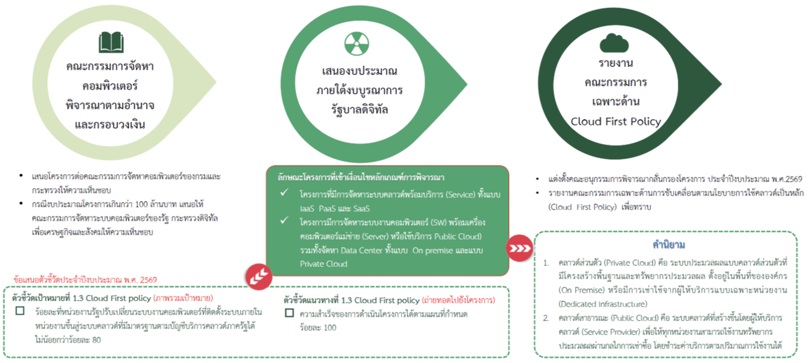

## ลักษณะของโครงการด้านระบบคลาวด์และระบบ ICT และแนวทางดำเนินการสำหรับการใช้คลาวด์เป็นหลัก

| | โครงการระบบ IT ใหม่ ประจำปีงบประมาณ พ.ศ. 2569 | โครงการที่มีแผนการอัพเกรดระบบประจำปีงบประมาณ พ.ศ. 2569 หรือโครงการที่กำลังถึง End-of-life | โครงการอื่นๆ (อนาคต) |
| :---: | :--- | :--- | :--- |
| ลักษณะโครงการ | - โครงการที่จะขึ้นระบบคลาวด์ - โครงการที่มีการพัฒนาการจัดซื้อจัดหาระบบ Application หรือระบบ IT ต่างๆ ที่เกี่ยวข้องกับระบบ Cloud หรือ Server | - โครงการเดิมที่ต้องมีการซื้อ Server ใหม่เพื่อมาทดแทน Server ตัวเก่า  หรือขยาย Server ที่หมดอายุ เพื่อรองรับความต้องการที่เปลี่ยนไป - โครงการที่ต้องทำสัญญาเช่าใหม่ เช่าต่อเนื่อง หรือเปลี่ยนสัญญาเช่า บนระบบที่มีการใช้งานในปัจจุบัน - ระบบที่ต้องมีการซื้อ License ของ Software ที่กำลังหมดอายุ | ระบบงาน IT ที่มีการใช้งานอยู่ในปัจจุบัน และมีอายุการใช้งานที่ จะครบรอบอัพเกรด เปลี่ยนแปลง ในอนาคต |
| แนวทางการดำเนินงาน | - ระบบงานที่พัฒนาต้องใช้ระบบคลาวด์เป็นหลัก และใช้ Native service (IaaS, PaaS, SaaS) ของคลาวด์เป็นหลัก เพื่อความปลอดภัยและยืดหยุ่นในการทำงาน - หลีกเลี่ยงการซื้อ Software มาติดตั้งเป็น Function เสริม บน Cloud VM โดยเฉพาะหลายๆ Function ที่มีการให้บริการอยู่เป็น Cloud Native Service อยู่แล้วเช่น การซื้อ Firewall Software เป็นต้น - กรณีจำเป็นต้องซื้อ Software มาติดตั้งบน IaaS ต้องได้รับความเห็นชอบจาก CIO กระทรวง - กรณีที่มีความจำเป็นที่จะต้องใช้ระบบแบบ On-premise ต้องได้รับการอนุมัติจาก CIO กระทรวง  และต้องออกแบบให้เป็น Cloud-ready ในอนาคต | - พิจารณานำระบบขึ้น Cloud และใช้ Native service (PaaS, SaaS) เป็นหลัก - หากจะคงระบบ On-premise ควรมีกลไกการกลั่นกรอง | - จัดทำ Timeline แผนสำหรับการ Migration ขึ้นระบบคลาวด์ในอนาคต - รวบรวมจำนวน Server ที่ใช้อยู่ปัจจุบัน เพื่อแปลงเป็น VM และข้อมูลการใช้งาน (%Utilization, Specs, Software ที่ติดตั้ง เป็นต้น) |

## การประเมินงบประมาณของโครงการ

### 1. ปัจจัยในการพิจารณาเลือกส่วนประกอบ (component) ของระบบคลาวด์ 

โดยพิจารณาตามประเภทของปริมาณงาน (workload) , ขนาดของ workload และความต้องการด้านประสิทธิภาพทั้งนี้ ประเภท component ในระบบคลาวด์ ประกอบด้วย 

1. กลุ่มบริการสำหรับการประมวลผล (Compute)
2. กลุ่มบริการสำหรับจัดเก็บข้อมูล (Storage)
3. กลุ่มบริการสำหรับการเชื่อมต่อเครือข่าย(Networking)
4. กลุ่มบริการสำหรับจัดการฐานข้อมูล (Database)
5. กลุ่มบริการสำหรับวิเคราะห์ข้อมูล (Analytics)
6. กลุ่มบริการเครื่องมือสำหรับผู้พัฒนาระบบ (Developer & Management Tools)
7. กลุ่มบริการเครื่องมือความมั่นคงปลอดภัย (Security)
8. กลุ่มบริการอื่น ๆ

### 2. ประมาณการใช้งานของระบบตามแผนการพัฒนาและแผนการใช้งาน เช่น ขนาดของข้อมูลที่ใช้ประมวลผล ประมาณการผู้ใช้งานระบบ กำหนดระดับ SLA  และอื่นๆ ที่เกี่ยวข้อง

ข้อมูลสำคัญที่ต้องรวบรวมเพื่อใช้ประมาณการใช้งานของระบบ
* กรณีจัดซื้อสิทธิ์บริการลักษณะ software-as-a-service ให้ระบุปริมาณการใช้งานที่ต้องการสำหรับการจัดหาสิทธิ์นั้นๆ เช่น จำนวน active users เป็นต้น
* ประมาณการผู้ใช้งานระบบ เช่น
  * ข้อมูล pageviews (กรณีเป็นเว็บไซต์)
  * ข้อมูล transactions ที่อาจเกิดขึ้น
* ขนาดของข้อมูล เช่น 
  * ข้อมูลที่จัดเก็บเพื่อให้เข้าถึงได้โดยผู้ใช้งาน (contents)
  * ข้อมูลที่ผู้ใช้งาน upload เข้าสู่ระบบ (x ประมาณการธุรกรรม)
* ประมาณการปริมาณการใช้งานพร้อมกันที่อาจเกิดขึ้นสูงสุด (concurrent access)
  * หากท่านพบว่า ระบบท่านอาจมี concurrent access ที่สูง (เช่น มากกว่า 1,000 transactions per sec) ให้ปรึกษาผู้ให้บริการ
* ระดับความเสี่ยงของข้อมูลที่จัดเก็บ เพื่อเลือกใช้บริการเพิ่มเติมด้านความปลอดภัย เช่น web application firewall, DDoS protection เป็นต้น
  * ให้ประมาณการข้อมูลที่เกิดขึ้นในแต่ละเดือน โดยนำพฤติกรรมการใช้งานมาใช้ประกอบการประเมิน เช่น ช่วงเวลาที่มีการใช้งานมากเป็นพิเศษ
  * หากหน่วยงานมีการใช้บริการ Cloud อยู่แล้ว ให้นำข้อมูลเดิม พร้อมคาดการณ์ธุรกรรมที่อาจเพิ่มขึ้น หรือลดลง มาใช้ประกอบการพิจารณา

### 3. ประมาณค่าใช้จ่ายลงทุนในการพัฒนาระบบ และ/หรือการใช้งานระบบด้วยเครื่องโปรแกรมคำนวณ (calculator) สำหรับภาครัฐ จากผู้ให้บริการคลาวด์

ให้ประเมินค่าใช้จ่ายในแต่ละเดือน โดย
* ให้เลือกใช้ขนาดของบริการให้สอดคล้องกับประมาณการใช้งานในแต่ละเดือน (หากบางเดือนมีการใช้งานมากเป็นพิเศษ ให้ประเมินค่าใช้จ่ายเพิ่มเติมเฉพาะเดือนนั้น ๆ ได้)
* เป็นการประเมินค่าใช้จ่ายเพื่อของบประมาณเท่านั้น แต่การเบิกจ่ายให้เป็นแบบ Pay-per-Use

#### ตัวอย่างการใช้โปรแกรมคำนวณ (Calculator)

คุณสมบัติที่กำหนด
* Web Application หรือ Web Service
* ปริมาณการใช้งาน ไม่เกินเดือนละ 1 ล้าน pageviews
* พัฒนาด้วยภาษาทั่วไป เช่น PHP, ASP.NET
* ใช้ระบบฐานข้อมูล RDBMS ที่ compatible กับ Postgresql หรือ MySQL
* ใช้ Object Storage ที่ compatible กับ S3 ในการจัดเก็บไฟล์ข้อมูล
* มี Firewall และ Web Application Firewall (WAF) สำหรับใช้ป้องกันการโจมตี

ตัวอย่างองค์ประกอบ (components) และราคาจากผู้ให้บริการ
* AWS : https://dg.th/6jfvs0in75 
* Google : https://dg.th/t3jy408eux
* Huawei : 
* Microsoft : https://dg.th/1z5u6hjylf 
* Tencent : [ตัวอย่างการราคา](/Uploads/cloud_tencent_prices.xlsx)

### 4. สรุปภาพรวมงบประมาณของโครงการตลอดแผนการพัฒนา และแผนการใช้งาน

* จัดทำคำของบประมาณส่งไปยัง สพร. ตามเวลาที่กำหนด (19 พ.ย. – 18 ธ.ค. 2568)
  * ตัวอย่างแบบคำขอ (อยู่ระหว่างดำเนินการ)
  * ตัวอย่าง TOR งานจ้างบริการคลาวด์สำหรับบริการ/ระบบ .... ของหน่วยงาน (อยู่ระหว่างดำเนินการ)
* ใบคำของบประมาณ ให้แยกค่าใช้จ่ายในส่วนของบริการคลาวด์ออกมาให้ชัดเจน
* นำข้อมูลจากโปรแกรมคำนวณราคา (price calculator) ของผู้ให้บริการคลาวด์ มาแนบประกอบคำของบประมาณ

**หากหน่วยงานมีความจำเป็นต้องใช้ private cloud กับข้อมูลที่ไม่ใช่ระดับ top secret** ซึ่งไม่สอดคล้องกับแนวทางการจำแนกประเภทข้อมูล และการเลือกใช้บริการคลาวด์ ให้แจ้งต่อ สพร. เพื่อนำเสนอต่อคณะทำงานพิจารณากลั่นกรองโครงการ ฯ พร้อมรายละเอียด ดังนี้

1. ผลการประเมินระดับชั้นข้อมูล ตามประกาศสำนักงานพัฒนารัฐบาลดิจิทัล (องค์การมหาชน) เลขที่ ม 1/2565 เรื่อง มสพร. 8-2565 มาตรฐานสำนักงานพัฒนารัฐบาลดิจิทัล (องค์การมหาชน) ว่าด้วยหลักเกณฑ์การจัดระดับชั้นข้อมูลและแบ่งปันข้อมูลภาครัฐ
2. ผลการวิเคราะห์ความคุ้มค่า ตลอดอายุการใช้งานของระบบ ตั้งแต่ การลงทุนจัดหาและติดตั้งระบบ การบำรุงรักษา การบริหารจัดการ จนถึงการยุติการใช้งาน
3. มาตรฐานและแนวทางการรักษาความมั่นคงปลอดภัย และการบริหารจัดการ private cloud ของหน่วยงาน เช่น ISO27001
4. ระดับความพร้อมของเจ้าหน้าที่ด้านเทคนิคของหน่วยงาน
