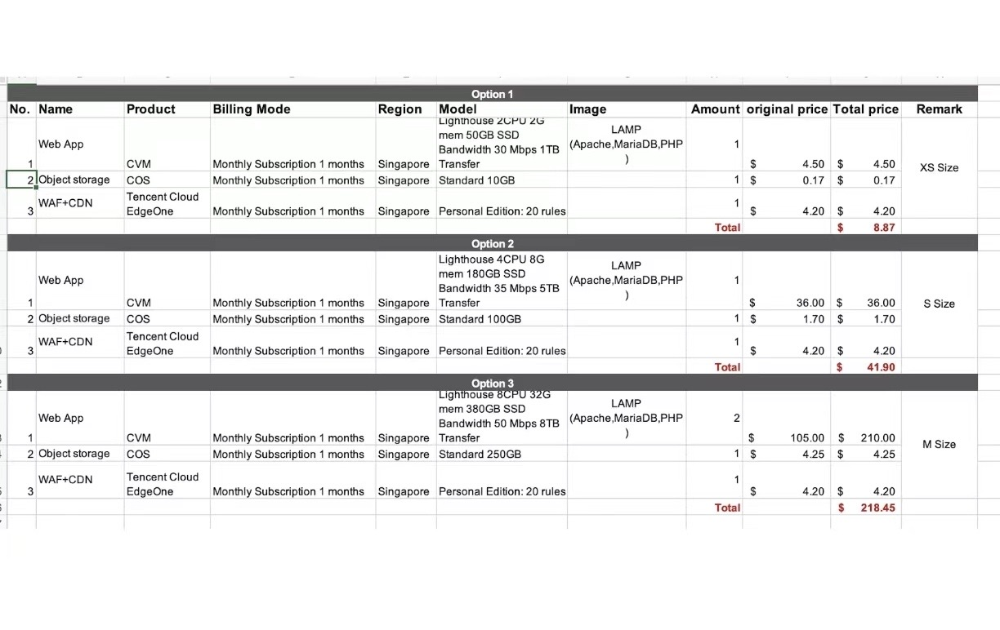

## ลักษณะของโครงการด้านระบบคลาวด์และระบบ ICT และแนวทางดำเนินการสำหรับการใช้คลาวด์เป็นหลัก

| | โครงการระบบ IT ใหม่ ประจำปีงบประมาณ พ.ศ. 2569 | โครงการที่มีแผนการอัพเกรดระบบประจำปีงบประมาณ พ.ศ. 2569 หรือโครงการที่กำลังถึง End-of-life | โครงการอื่นๆ (อนาคต) |
| :---: | :--- | :--- | :--- |
| ลักษณะโครงการ | - โครงการที่จะขึ้นระบบคลาวด์ - โครงการที่มีการพัฒนาการจัดซื้อจัดหาระบบ Application หรือระบบ IT ต่างๆ ที่เกี่ยวข้องกับระบบ Cloud หรือ Server | - โครงการเดิมที่ต้องมีการซื้อ Server ใหม่เพื่อมาทดแทน Server ตัวเก่า  หรือขยาย Server ที่หมดอายุ เพื่อรองรับความต้องการที่เปลี่ยนไป - โครงการที่ต้องทำสัญญาเช่าใหม่ เช่าต่อเนื่อง หรือเปลี่ยนสัญญาเช่า บนระบบที่มีการใช้งานในปัจจุบัน - ระบบที่ต้องมีการซื้อ License ของ Software ที่กำลังหมดอายุ | ระบบงาน IT ที่มีการใช้งานอยู่ในปัจจุบัน และมีอายุการใช้งานที่ จะครบรอบอัพเกรด เปลี่ยนแปลง ในอนาคต |
| แนวทางการดำเนินงาน | - ระบบงานที่พัฒนาต้องใช้ระบบคลาวด์เป็นหลัก และใช้ Native service (IaaS, PaaS, SaaS) ของคลาวด์เป็นหลัก เพื่อความปลอดภัยและยืดหยุ่นในการทำงาน - หลีกเลี่ยงการซื้อ Software มาติดตั้งเป็น Function เสริม บน Cloud VM โดยเฉพาะหลายๆ Function ที่มีการให้บริการอยู่เป็น Cloud Native Service อยู่แล้วเช่น การซื้อ Firewall Software เป็นต้น - กรณีจำเป็นต้องซื้อ Software มาติดตั้งบน IaaS ต้องได้รับความเห็นชอบจาก CIO กระทรวง - กรณีที่มีความจำเป็นที่จะต้องใช้ระบบแบบ On-premise ต้องได้รับการอนุมัติจาก CIO กระทรวง  และต้องออกแบบให้เป็น Cloud-ready ในอนาคต | - พิจารณานำระบบขึ้น Cloud และใช้ Native service (PaaS, SaaS) เป็นหลัก - หากจะคงระบบ On-premise ควรมีกลไกการกลั่นกรอง | - จัดทำ Timeline แผนสำหรับการ Migration ขึ้นระบบคลาวด์ในอนาคต - รวบรวมจำนวน Server ที่ใช้อยู่ปัจจุบัน เพื่อแปลงเป็น VM และข้อมูลการใช้งาน (%Utilization, Specs, Software ที่ติดตั้ง เป็นต้น) |

### ตัวอย่างการใช้โปรแกรมคำนวณ (Calculator)

* AWS : https://dg.th/6jfvs0in75 
* Google : https://dg.th/t3jy408eux
* Huawei : 
* Microsoft : https://dg.th/1z5u6hjylf 
* Tencent : 

