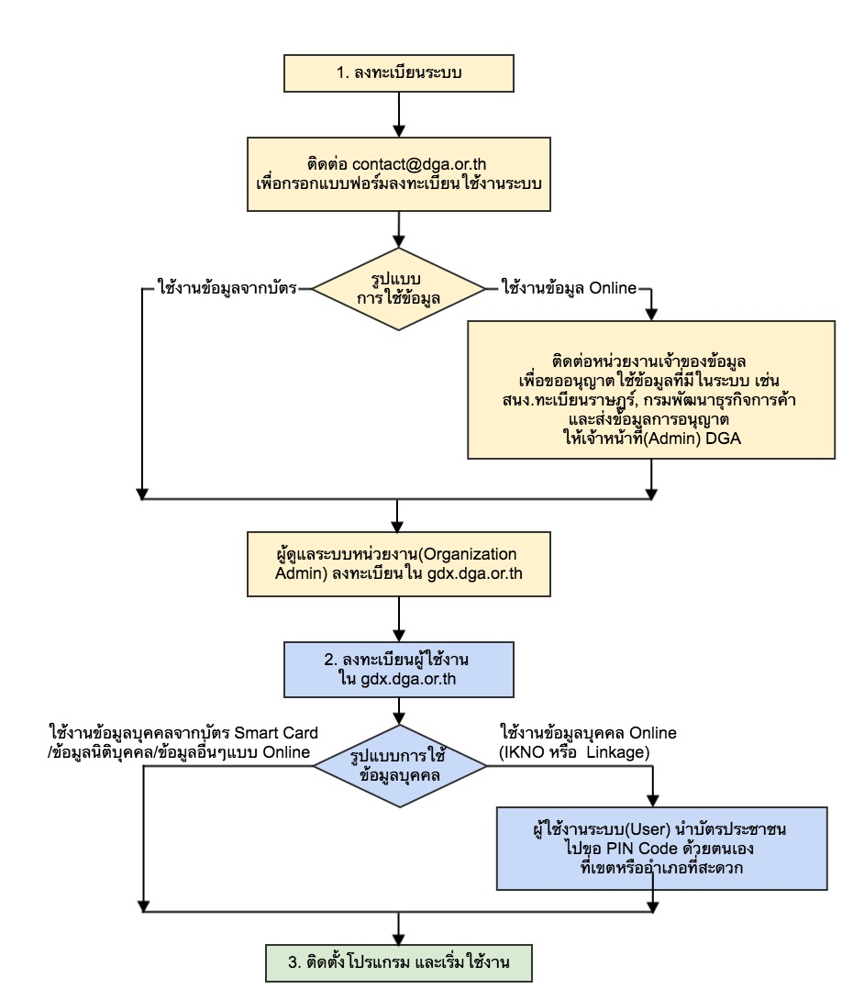

สำหรับหน่วยงานภาครัฐที่สนใจเชื่อมโยงข้อมูลต่างๆ เพื่อใช้ในการให้บริการประชาชน หรือใช้ในงานอื่นๆ ตามภารกิจของตน ไม่ว่าจะขอเชื่อมโยงข้อมูลแบบ machine-to-machine (ผ่าน api) หรือแบบใช้ข้อมูลผ่านแอปพลิเคชันของ สพร. 

*** บริการนี้ ไม่เปิดให้ประชาชนทั่วไป หรือภาคเอกชนใช้งาน ***

## แนวทางการขอรับบริการ
  
### หน่วยงานระดับกรม

- หน่วยงานทั่วไปที่สนใจใช้บริการ แต่ยังไม่มีข้อตกลงการเชื่อมโยงข้อมูลกับหน่วยงานที่เกี่ยวข้อง ให้เน้นการใช้ข้อมูลจากบัตรประจำตัวประชาชน โดยใช้เครื่องอ่านบัตร (Smart Card Reader) ก่อน
  - หน่วยงานสามารถเรียกดูข้อมูลจากบัตรประจำตัวประชาชน และบันทึกข้อมูลดังกล่าวในรูปแบบดิจิทัลได้ ทดแทนการขอสำเนาบัตรประจำตัวประชาชนจากผู้ขอรับบริการ
  หน่วยงานสามารถจัดหาเครื่องอ่านบัตร (Smart Card Reader) ได้จากท้องตลาดทั่วไป ราคาไม่เกินเครื่องละ 500 บาท (https://www.lazada.co.th/catalog/?q=smart+card+reader&_keyori=ss&from=input&spm=a2o4m.home.search.go.1125719cdTlaWc)
- กรณีที่หน่วยงานสนใจเชื่อมโยงข้อมูลอื่น แบบออนไลน์ เช่น ข้อมูลทะเบียนราษฎร ข้อมูลนิติบุคคล
  - ให้ศึกษารายการข้อมูลที่สามารถเชื่อมโยงผ่านระบบ GDX ได้จาก https://gdx.dga.or.th/DataCatalog/Dictionary และ https://linkagemgmt.bora.dopa.go.th/#/ 
  - หน่วยงานจำเป็นต้องทำหนังสือขอใช้ข้อมูลดังกล่าวจากหน่วยงานที่เกี่ยวข้อง และเมื่อได้รับอนุมัติให้ใช้ข้อมูลแล้ว ให้แจ้ง สพร. เพื่อเปิดสิทธิในการใช้งานข้อมูลให้หน่วยงานเพิ่มเติม
  - หน่วยงานที่สนใจใช้ข้อมูลอื่นที่ยังไม่ได้อยู่ในรายการข้างบน ให้แจ้งช้อมูลที่ประสงค์จะเชื่อมโยง / หน่วยงานผู้รับผิดชอบข้อมูลดังกล่าว และ บริการ/ภารกิจที่หน่วยงานจำเป็นต้องนำข้อมูลนั้นไปใช้ ให้ สพร. เพื่อรวบรวม และเชื่อมโยงข้อมูลดังกล่าวเข้าสู่ระบบ GDX ต่อไป
- กรณีที่หน่วยงานมีข้อมูลที่สนใจเปิดให้หน่วยงาน/ประชาชนนำไปใช้ประโยชน์
  - กรณีเป็นข้อมูลเปิด / ประชาชนทั่วไปสามารถเข้าถึงได้ ให้เชื่อมโยงเข้าระบบ data.go.th
  - กรณีเป็นข้อมูลที่ใช้เฉพาะในส่วนราชการ ให้แจ้งมาที่ สพร. เพื่อนัดหมายเข้าไปหารือต่อ่ไป

### หน่วยงานส่วนภูมิภาค

- ให้หน่วยงานส่วนกลางเป็นผู้ดำเนินการประสานขอเชื่อมโยงข้อมูลกับหน่วยงานที่เกี่ยวข้องผ่านระบบ GDX
- หากส่วนกลางได้ดำเนินการแล้ว ให้หน่วยงานส่วนภูมิภาคประสานขอสิทธิในการเข้าถึงข้อมูลจากส่วนกลางต่อไป

### หน่วยงานส่วนท้องถิ่น

ดำเนินการในลักษณะเดียวกับหน่วยงานระดับกรม

## ขั้นตอนเริ่มใช้งาน
  
ขั้นตอนการติดต่อเพื่อขอใช้งานระบบ

#### (ขั้นตอนที่ 1) ลงทะเบียนระบบ
  
กรณี ขอใช้งาน Web site GDX

* ติดต่อ contact@dga.or.th เพื่อกรอกแบบฟอร์มลงทะเบียนใช้งานระบบ พร้อมรายชื่อสาขาย่อยของหน่วยงานในรูปแบบ excel(ถ้ามี) เพื่อให้เจ้าหน้าที่สำนักงานพัฒนารัฐบาลดิจิทัลทำการตั้งค่าระบบให้ (ระยะเวลา 1-2 วัน) : แบบฟอร์มการลงทะเบียน
* กรณีที่ท่านต้องการใช้งานข้อมูลอื่นนอกจากข้อมูลจากบัตรประชาชน (smart card) ท่านต้องติดต่อหน่วยงานเจ้าของข้อมูล เพื่อขออนุญาตใช้ข้อมูลที่มีในระบบ เช่น สนง.ทะเบียนราษฏร์, กรมพัฒนาธุรกิจการค้า และส่งข้อมูลการอนุญาตให้เจ้าหน้าที่(Admin) (ระยะเวลา ขึ้นอยู่กับการประสานงานของหน่วยงานเอง)
* ผู้ดูแลระบบหน่วยงาน(Organization Admin) เข้าลงทะเบียนใน gdx.dga.or.th และรอสำนักงานพัฒนารัฐบาลดิจิทัล ตรวจสอบ และอนุมัติ เปิดสิทธิเข้าใช้เมนูต่างๆ (ระยะเวลา 1-2 วัน)

กรณี ขอเชื่อมโยงข้อมูลแบบ machine-to-machine (ผ่าน api)  

* ติดต่อ contact@dga.or.th เพื่อกรอกแบบฟอร์มลงทะเบียนใช้งาน API 
* หน่วยงานต้องมีการขออนุญาตการเข้าถึงข้อมูลของหน่วยงานเจ้าของข้อมูล อาทิ สนง.ทะเบียนราษฏร์, กรมพัฒนาธุรกิจการค้า (กรณี ขอใช้API - กรมพัฒนาธุรกิจการค้า ต้องแจ้งให้ทาง กรมพัฒนาธุรกิจการค้า ทราบด้วยว่าจะขอเชื่อมโยงผ่าน สพร. และนำข้อมูล User/Pass ที่ได้รับส่งให้ สพร. เพื่อตั้งค่าการเรียกใช้ต่อไป)
* กรณีขอใช้งานมาที่สพร. แล้ว เมื่อเจ้าหน้าที่ สพร. ตั้งค่า การเรียกใช้ API ให้หน่วยงานแล้ว ระบบจะส่ง consumer key / secret key ไปยังอีเมล์ทีไ่ด้ระบุไว้ตามใบคำขอใช้บริการ แบบอัตโนมัติ (ส่งโดยระบบ) กรณีที่หน่วยงานไม่ได้รับ key สามารถประสานแจ้ง contact@dga.or.th  เพื่อทำการ renew key ให้ได้

#### (ขั้นตอนที่ 2) ลงทะเบียนผู้ใช้งาน
  
ผู้ใช้งานระบบ(User) ลงทะเบียนใน gdx.dga.or.th(โดยใช้ GovID/Mailgothai หรือ OpenID) และรอผู้ดูแลระบบหน่วยงานของท่านเอง ตรวจสอบและอนุมัติ เปิดสิทธิเข้าใช้เมนูต่างๆ (ระยะเวลา ขึ้นอยู่กับผู้ดูแลหน่วยงานกำหนดเอง)

**การใช้งานเพื่อดูข้อมูลที่ได้รับอนุญาติตามสิทธิของ ผู้ดูแลระบบ (Organization Admin) และ ผู้ใช้งาน (User) ต้องนำบัตรประชาชนไปติดต่อที่สำนักงานเขตหรืออำเภอเพื่อขอรหัส Pin Code 4 หลักด้วยตนเอง**

หมายเหตุ : กรณีใช้งาน website : สพร. จะอนุมัติผู้ดูแลระบบของหน่วยงาน เพียง 1 ท่าน (ตามใบคำขอใช้บริการ) เมื่อผู้ดูและรบบของหน่วยงานได้รับการอนุมัติสิทธิ์แล้วจะเป็นผู้อนุมัติสิทธิ์ให้กับผู้ใช้ท่านอื่นๆ ของหน่วยงานด้วยตนเอง (หรือสามารถกำหนดผู้ดูแลระบบของหน่วยงานท่านอื่นๆ ได้เช่นกัน) กรณีมีการปรับเปลียนผู้ดูแลระบบหลักตามใบคำขอ ต้องแจ้งสพร. ทราบทุกครั้ง (เพื่อประโยชน์ของหน่วยงานในการติดต่อประสาน และรับแจ้งข่าวสาร)

#### (ขั้นตอนที่ 3) ติดตั้งโปรแกรม และเริ่มใช้งาน
  
ผู้ใช้งานระบบ(User) สามารถติดตั้งโปรแกรมเสริมต่างๆด้วยตนเอง เช่น โปรแกรม AMI , Reader และสามารถเริ่มใช้งานได้ทันที

### เอกสารการลงทะเบียนมีอะไรบ้าง
  
แบบฟอร์มการลงทะเบียน GDX (Web GDX หรือ API) [ตามเอกสารแนบ](../../../assets/files/FM-C17-016-Rev.2-GDX.pdf)

### การขอสิทธิ์การใช้งานข้อมูลต่างๆ จากหน่วยงานที่เกี่ยวข้อง
  
ขอสิทธิ์การใช้งานข้อมูลบุคคลจากบัตรประจำตัวประชาชน (Smart Card)
เจ้าหน้าที่หน่วยงานไม่ต้องขอใช้สิทธิ์การใช้ข้อมูลจากกรมการปกครอง สามารถใช้งานได้ทันที

**ขอสิทธิ์การใช้งานข้อมูลบุคคล Linkage Center อย่างไร**

1. ทำหนังสือขออนุญาตการใช้ข้อมูลกับหน่วยงานเจ้าของข้อมูล
2. ทำหนังสือขออนุญาตเพื่อใช้งานข้อมูลบุคคล กับ สนง.ทะเบียนราษฏร์ กรมการปกครอง พร้อมแนบสำเนาหนังสือการอนุญาตให้ใช้ข้อมูลจากหน่วย่งานเจ้าของข้อมูล
3. ลงทะเบียน Super User Linkage Center ไปยัง สนง.ทะเบียนราษฏร์
4. เมื่อเจ้าหน้าที่หน่วยงานได้รับสิทธิ์ Super User Linkage Center แล้ว Super User สามารถลงทะเบียนและจัดการสิทธิ์ของเจ้าหน้าที่หน่วยงานที่เป็นผู้ใช้งานระบบ(User) ในหน่วยงานท่านเองได้ตามคู่มือในระบบ Linkage Management
5. หน่วยงานที่ต้องการใช้งานข้อมูลดังกล่าวต้องดำเนินการตามแนวทางปฏิบัติเกี่ยวกับการเก็บรักษา การตรวจสอบและควบคุมการเข้าใช้ข้อมูลทะเบียนราษฏรเพื่อคุ้มครองข้อมูลส่วนบุคคล การแก้ไขปรับปรุงข้อมูลให้ถูกต้อง และการเชื่อมโยงคอมพิวเตอร์เพื่อใช้ประโยชน์ข้อมูลจากฐานข้อมูลทะเบียนประวัติราษฎรในการปฏิบัติหน้าที่และการบริการภาครัฐของส่วนราชการและหน่วยงานของรัฐ ตามระเบียบสำนักทะเบียนกลางว่าด้วยการคุ้มครองและการจัดการข้อมูลทะเบียนประวัติราษฎร โดยเคร่งครัด

* [ตัวอย่าง MOU ระหว่างกรมการปกครองและหน่วยงานผู้ขอใช้ข้อมูลทะเบียนราษฎร](@assets/files/20180920113012.pdf) **ปัจจุบันกรมการปกครองไม่จำเป็นต้องให้ทำ MOU แล้ว**
* ให้จัดทำเป็นหนังสือขอเชื่อมโยงข้อมูลมาแทน โดยในการเชื่อมโยง ต้องดำเนินการภายใต้ [ระเบียบที่เกี่ยวข้อง](@assets/files/ppt_สาระสำคัญของระเบียบสำนักทะเบียนกลาง_ฉบับใหม่.pdf)

**ขอสิทธิ์การใช้งานข้อมูลนิติบุคคล IKNO อย่างไร**

1. ทำหนังสือขออนุญาตเพื่อใช้งานข้อมูลบุคคล กับ สนง.ทะเบียนราษฏร์ กรมการปกครอง
2. กรอกแบบฟอร์มลงทะเบียน User ไปยัง สนง.ทะเบียนราษฏร์ (แบบฟอร์มลงทะเบียน User IKNO)

หน่วยงานที่ต้องการใช้งานข้อมูลดังกล่าวต้องดำเนินการตามแนวทางปฏิบัติเกี่ยวกับการเก็บรักษา การตรวจสอบและควบคุมการเข้าใช้ข้อมูลทะเบียนราษฏรเพื่อคุ้มครองข้อมูลส่วนบุคคล การแก้ไขปรับปรุงข้อมูลให้ถูกต้อง และการเชื่อมโยงคอมพิวเตอร์เพื่อใช้ประโยชน์ข้อมูลจากฐานข้อมูลทะเบียนประวัติราษฎรในการปฏิบัติหน้าที่และการบริการภาครัฐของส่วนราชการและหน่วยงานของรัฐ ตามระเบียบสำนักทะเบียนกลางว่าด้วยการคุ้มครองและการจัดการข้อมูลทะเบียนประวัติราษฎร โดยเคร่งครัด

**ขอสิทธิ์การใช้งานข้อมูลนิติบุคคล อย่างไร**

1. หน่วยงานทำหนังสือขอใช้ข้อมูลนิติบุคคลไปยังกรมพัฒนาธุรกิจการค้า(DBD) โดยระบุในหนังสือว่า ขอเชื่อมโยงข้อมูลนิติบุคคลผ่านสำนักงานพัฒนารัฐบาลดิจิทัล (องค์การมหาชน) [ตัวอย่างหนังสือขออนุญาตเชื่อมโยงข้อมูล](@assets/files/หนังสือขออนุญาตเชื่อมโยงข้อมูลกรมพัฒนาธุรกิจการค้า.pdf)
2. เมื่อได้รับสิทธิ์โดยได้ Username Password แล้ว ให้จัดส่งข้อมูลดังกล่าวให้ สพร. เพื่อทำการตั้งค่าการใช้งานระบบต่อไป

### สิ่งที่หน่วยงานท่านต้องเตรียมการ
  
กรณีที่ต้องการใช้ข้อมูลบุคคล ไม่ว่าจะเป็นการอ่านข้อมูลจากบัตรประจำตัวประชาชน (Smart Card) หรือการเชื่อมโยงข้อมูลจากฐานข้อมูลทะเบียนราษฎร ท่านต้องมีเครื่องอ่านบัตรประจำตัวประชาชน (Smart Card Reader) 1 เครื่องสำหรับเจ้าหน้าที่ที่ต้องเข้าถึงข้อมูลดังกล่าวแต่ละท่าน โดยอุปกรณ์ดังกล่าวมีคุณสมบัติตามเอกสารแนบ

การให้บริการของ สพร. ไม่ครอบคลุมถึงการสนับสนุนเครื่องอ่านบัตรประจำตัวประชาชน (Smart Card Reader)